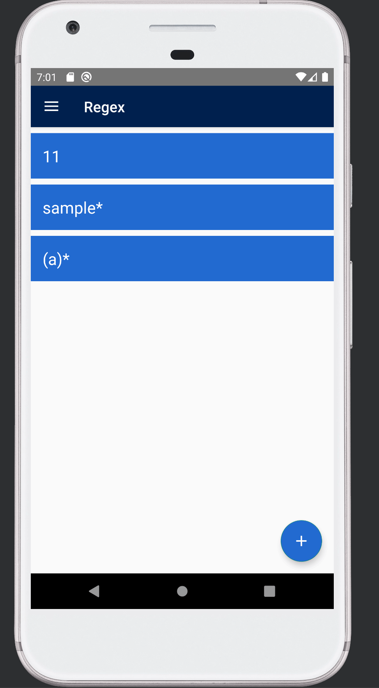
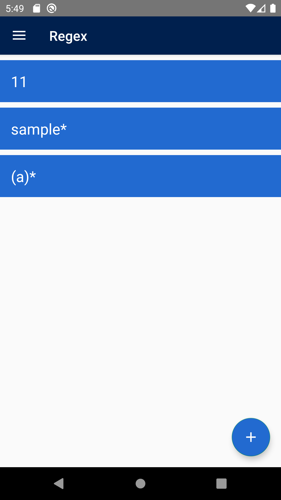
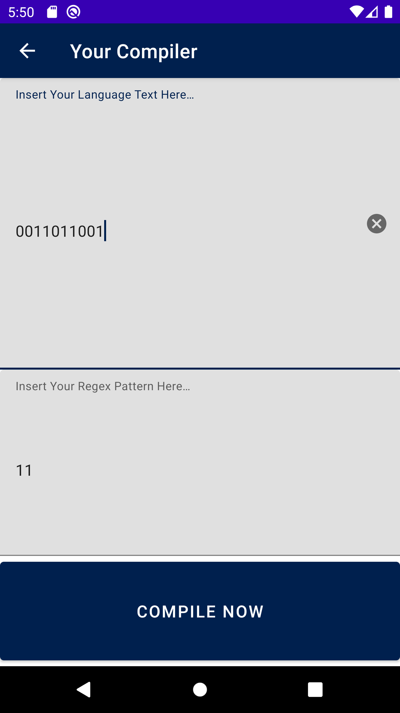
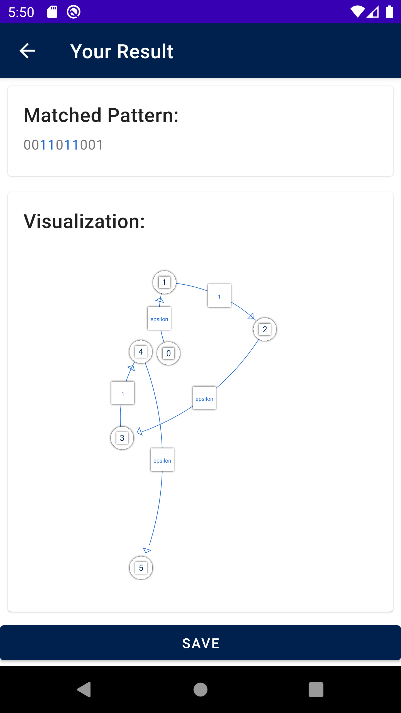

## Regular expression toolkit - Group-030 (uwutever) Course Project
This repository was originally created as a course project for 
**[CSC207H1: Software Design](https://artsci.calendar.utoronto.ca/course/csc207h1)**, an introductory course about 
Software Design at the University of Toronto, in the Fall 2021 term.

Our project aims to facilitate the teaching of regular expressions in computational language theory by providing features such
as matching between text strings and  a regular expression, and visualization of Finite State Automata (*FSA*).

Contributors: Kevin Gao, Hanrui Fan, Arkaprava Choudhury, Brian Ho, Franklin Yeung, Letian Cheng

#### Back-end
To see the back-end demo, please visit src/test/demo/DemoPhase1 and follow the instructions there to use the CLI for text-matching

#### Front-end

See RegexApp. *Note:* if you are using android studio, please open folder `RegexApp`.
### UI Demo:

