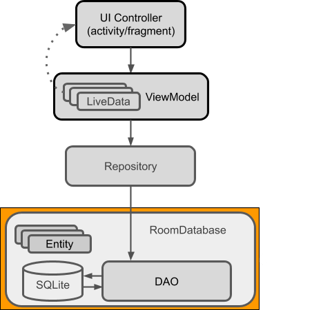

# Design Document

## SOLID Design Principles
### Single Responsibility Principle
Our design abided by the single responsibility principle: we created a separate class for each responsibility in our program, 
most according to the CRC model we created earlier in phase 0.

There were a few improvements we made to the CRC model, including splitting the FSA/DFA/NFA class up, 
making `DFA` and `NFA` subclasses of the `FSA` abstract class, since they have separate responsibilities.

Both of these classes will be built utilizing the `FSABuilder` interface, however, they have different responsibilities:  
The compiler compiles the parsed Abstract Syntax Tree into an `NFA` since that can be done in a more straightforward manner. 
The `NFA` is then converted into `DFA` to complete the matching since a `DFA` is more efficient (especially if the user will 
be matching the multiple strings to the same regular expression). This `DFA` will be stored for later use.

In terms of the user interface, each of the activities (each screen) has a single object that is only responsible for 
that screen. We have separate view models for UI patterns.

### Open/Closed Principle
Backend: We have created subclasses for the nodes in the AST and subclasses for different `NFA`'s (based on their construction),
if needed, more subclasses can be created and added without affecting the behaviour of the existing ones.
  
Frontend: Since our UI is split into different activities, we can easily add new functions to each activity without 
having to modify other activities. Also, We use callback for buttons, so we can easily add functions 
in object for new functions.

### Liskov Substitution Principle
Backend: We must have that any object of a particular type must be replaceable with an object of its superclass, 
if such a superclass exists. Indeed, in our implementation of the algorithm, we have multiple such cases of subclasses, 
which we shall now see, case-by-case.

Firstly, we have six subclasses of the `NFA` class, which are seen in the nfa package in the code; as can be verified, 
each of these subclasses is replaceable instead by an object of type NFA. Next, the `NFA` and `DFA` classes are subclasses 
of the `FSA` class. Even though each of the subclasses of NFA also represents an `FSA`, we rely upon this additional layer 
of inheritance in order to preserve the property of utilizing any subclass instead of its superclass without encountering 
any errors. A similar example holds true for the case of the `ASTNode` abstract superclass and its subclasses.

Frontend: We extended many of the classes in the Android framework to implement our own functionality without breaking 
the system (such as `RegexRoomDatabase extends RoomDataBase`, which is a system super class.)

### Interface Segregation Principle
Currently, the `StateTransition` class **DOES NOT** follow the interface segregation principle

FrondEnd: UI only depends on android system interface and backend API

### Dependency Inversion Principle
Backend: The only major couplings existing in our design are between `NFA` and `NFAState`, and between `Parser` and `ASTNode`, 
all of which are low-level classes, so the dependency inversion principle is upheld.

FrontEnd: For example, the UI accesses a database from the repository object, which is a high-level module for deciding
where the data should be accessed from (e.g. remote or local). The repository module is then dependent on the `RoomDatabase`
interface, which is a high level module of the actual SQL database.

## Clean Architecture

This is a UML diagram for our user interface design. It can be seen that the UI controller (`MainActivity`, `SecondActivity`,
and `ThirdActivity`) controls the view of the viewmodel (./layout). Furthermore, the viewmodel depends on `Repository` 
(`RegexRepository`) for data. `Repository`'s then use database packages (db) to get local data, 
since we don’t need to get data from the internet for now. In Database, we got a DAO (`RegexDao`) in charge of the 
interface for database accessing. Then, the `RegexRoomDatabase` implements the details of accessing.

## Design Patterns
Backend: We used the **Builder** design pattern in `FSA` and `FSAState`, and we used inheritance between `NFA`, `DFA`, and `FSA`.

FrontEnd:  
- We used the **Observer** Design Pattern, the whole process is that we set up an observer on the datalist which looked 
for insertion of any new LiveData storing (`Regex`) to the database and update the datalist. The observer is then used 
to notify that there is a change and has a method onChanged() when changes happen. This method will call `RegexCardAdapter`
to update its cache and then show it on the screen for the user to see.
- We also used the **Adapter** Design Pattern. `RegexCardAdapter` acts like a bridge between the `View` object for `
RecyclerView` and the underlying data for each `RegexObj` item. This approach was first discussed after we made the 
first version of the app with Buttons to click to each `Regex`. But we determined it to be infeasible since it cannot 
work if we wanted to add new `RegexObj`'s, since we cannot make a lot of Buttons invisible.
That’s inefficient code, so when we decided to use `RecyclerView` in Android, we needed to create this Adapter.

## Use of GitHub Features
The project was divided into several tasks, with the broadest level of such division of labour being the separation of 
the front-end from the back-end. Each of the “sub-groups” worked on different features in separate branches and used pull
requests to merge to the main branch only when sufficient progress was achieved. Doing so helped to avoid having messy 
code that would be hard to collaborate upon.

In addition to the commonly used feature of branches to separate working on different aspects of the code, we also 
utilized the ability to create a fork of the GitHub repository, in which the group members were able to make their own 
changes to the project code. This was especially useful since one of our members was unable to commit directly to the 
GitHub repository due to some technical difficulties arising from setting up repository permissions. The advantage of 
doing so was that we reduced noise coming from having multiple pull requests. In addition, each fork could be developed 
independently of others, with its own set of branches and pull requests and discussions.

We manually resolved merge conflicts and gradle issues arising from trying to merge branches or forks using git when the
automatic system of GitHub was unsuccessful in the merging of the branches/forks.

## Code Style and Documentation
So far throughout the entire project, we have only received two style warnings and several deprecation warnings 
by IntelliJ. One style warning pertains to an unchecked casting in one of the DFA classes, which can be easily remedied 
given minimal extra time.

In terms of documentation, Javadoc has been provided for all public methods and some private methods whose functionalities
are not as immediately obvious.

The names of the great majority of the classes and methods are quite suggestive of their purpose. Along with the Javadoc,
our code should be very easy to understand. Methods that contain specific algorithms have comments accompanying each step
in the algorithm that explain how the algorithm works. The authors feel confident that the structure of the code is 
sufficiently intuitive such that the intent of any member class can be understood by a Java programmer via the name of 
the class and documentation provided.

However, the code is not without its flaws. Admittedly, the construction of the NFA class does not make full use of the 
builder design pattern, and we can note the existence of certain code smells such as duplicated code in some parts of the 
project code. Most prominently, we wish to replace the various subclasses of the NFA superclass with an implementation 
that uses only two Reader and Builder objects to complete the necessary construction.

## Testing

Currently, since we have not yet integrated the backend of the project with the Android UI, the two parts have their own
testing packages.

FrontEnd: We manually test our UI.

Back-end: **TODO!**

## Refactoring
Indeed, our group has had multiple instances of refactoring in our code, although it is not apparent while simply 
looking at the pull requests. This is because we kept all moments of uncertainty leading up to potential refactoring 
contained within a single branch to not disrupt the other branches and any other progress made by the rest of the group.

When speaking about the implementation of the regex algorithms, the evidence of refactoring can be seen through various 
commits in each of the branches in the GitHub repository.

In particular, the two branches NFAImplementation and NFAImplementation2 can be seen to demonstrate the most prominent 
example of refactoring; Here, we experimented with two vastly different methods of implementing the `NFA` objects, with 
and without using a separate class to store the states. In turn, the results of such refactoring is visible in the branch
*phase1*. NOTE: Point to specific commits.

We even had to refactor the NFA class with the builder pattern, as seen in the pull request by *bbrianh* titled `NFA 
builder implementation`.

Frontend: We don't have refactoring for now.

## Code Organization
We use the “by component” packaging strategy for our project, similar to the packaging strategy used by JavaShell. 
This can be noticed by observing that we have divided packages based on which component of the code they pertain to, 
rather than which features they are responsible for. We have thus identified and broken up our project into a lexer 
component, a parser, several classes regarding the construction of various types of automata, a compiler, and finally 
(but most visible aspect) the android development part.

We have further sub-divided each of the above packages depending on the level of complexity involved in creating those
objects.

## Functionality

As far as functionality goes, we have been able to achieve text matching, that is, checking whether a given input string
is in the language described by the regular expression. 

The front-end part of the project is basically finished, but we have yet to integrate the back-end with it, we expect the
functionality of controlling the program using the Android interface can be completed very soon. In the future, we hope
to improve upon the front end to make it more visually appealing and user-friendly.

## Future Plans
 - Pattern matching;
 - Use Factory method for Compiler
 - Increased data persistence: Providing the user with an option to store regex “snippets” which they feel will be frequently searched for.
 - Integrating UI and backend; any necessary refactoring involved in the integration process
 - beautifying the UI;
