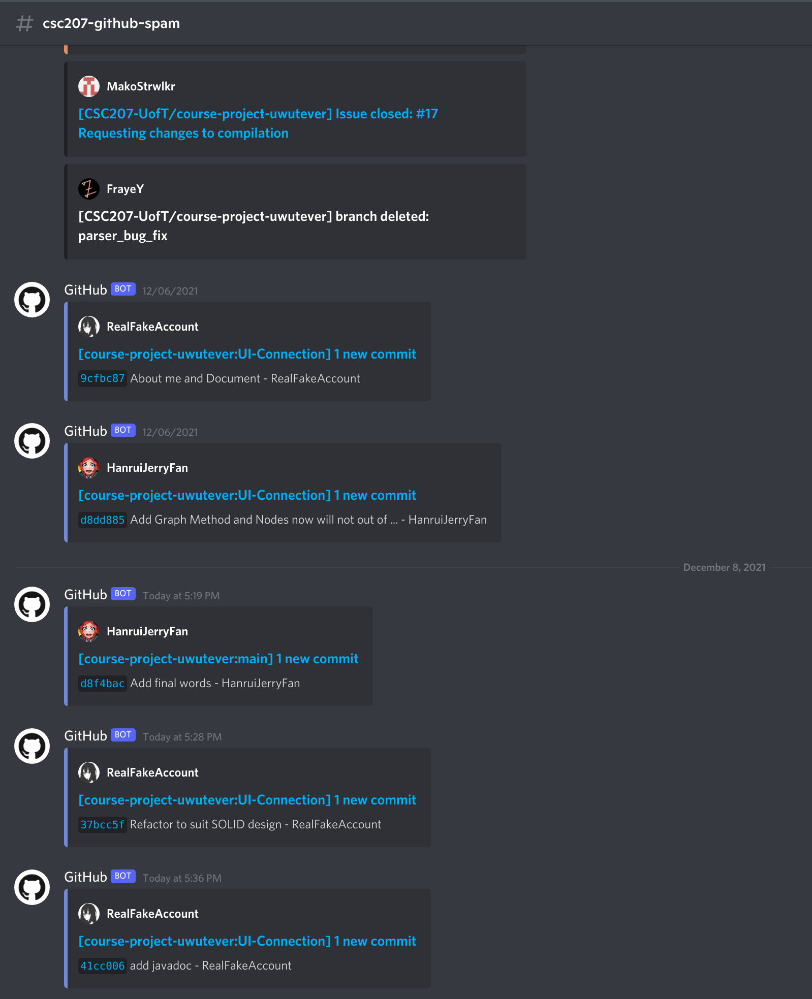

# Design Document

This design document was initially made for the final phase of the CSC207 course project by team uwutever.

## SOLID Design Principles
### Single Responsibility Principle
Our design abided by the single responsibility principle: we created a separate class for each responsibility in our program,
most according to the CRC model we created earlier in phase 0.

There were a few improvements we made to the CRC model, including splitting the FSA/DFA/NFA class up,
making `DFA` and `NFA` subclasses of the `FSA` abstract class, since they have separate responsibilities.

Both of these classes are built utilizing the `FSABuilder` interface, however, they have different responsibilities:  
The compiler compiles the parsed Abstract Syntax Tree into an `NFA` since that can be done in a more straightforward manner.
The `NFA` is then converted into `DFA` to complete the matching since a `DFA` is more efficient (especially if the user will
be matching the multiple strings to the same regular expression). This `DFA` will be stored for later use.

In terms of the user interface, each of the activities (each screen) has a single object that is only responsible for
that screen. We have separate view models for UI patterns.

FrontEnd: All our frontend code suit SRP. For example, We split the activities into separate classes. Therefore, if we want to modify a single activity,
only one activity class needs to be modified.

### Open/Closed Principle
Back-end: We have created subclasses for the nodes in the AST and subclasses for different `NFA`'s (based on their construction),
if needed, more subclasses can be created and added without affecting the behaviour of the existing ones.

Front-end: Since our UI is split into different activities, we can easily add new functions to each activity without
having to modify other activities. Also, We use callback for buttons, so we can easily add functions
in object for new functions.

### Liskov Substitution Principle
Back-end: We must have that any object of a particular type must be replaceable with an object of its superclass,
if such a superclass exists. Indeed, in our implementation of the algorithm, we have multiple such cases of subclasses,
which we shall now see, case-by-case.

As a particular example, we consider the case of the `ASTNode` abstract superclass and its subclasses. Each subclass can
be substituted for by the `ASTNode` superclass, and represents a particular case of ASTs. There are many more such
examples in the code which we shall not name in this document since attempting to create a .

Front-end: We extended many of the classes in the Android framework to implement our own functionality without breaking
the system (such as `RegexRoomDatabase extends RoomDataBase`, which is a system super class.)

### Interface Segregation Principle
In Phase 1, the `StateTransition` class did not follow the interface segregation principle, but now we have resolved this
issue by completely revamping the implementation of the automata. We have ensured that all interfaces are concise and carry
precise information and relevant methods only. For instance, the `Compiler` interface only enforces the `compile` method,
while the `RegexPattern` interface only enforces the `getFSA` and `getRegexStr` methods, and so on.

FrondEnd: UI only depends on android system interface and backend API

### Dependency Inversion Principle
Backend: There is no coupling between classes and the dependency only travels in one direction between layers, as can be
verified by the UML diagram attached in the following section.

FrontEnd: For example, the UI accesses a database from the repository object, which is a high-level module for deciding
where the data should be accessed from (e.g. remote or local). The repository module is then dependent on the `RoomDatabase`
interface, which is a high level module of the actual SQL database.

---

## Clean Architecture
### Backend

In brief, this diagram summarizes the high-level overview of our back-end architecture divided into the four layers of
the clean architecture. This model has come a long way from the initial CRC models we had proposed in Phase 0 with the
addition of more classes and better structure to make the code more readable and easier to maintain in the future.

The following diagram is also included as a means to offer more elaborate insight into the workings of the program and
highlight key dependencies between all the classes involved in constructing the back-end of this project.

### Frontend

This is a UML diagram for our user interface design. It can be seen that the UI controller (`MainActivity`, `SecondActivity`,
and `ThirdActivity`) controls the view of the viewmodel (./layout). Furthermore, the viewmodel depends on `Repository`
(`RegexRepository`) for data. `Repository`'s then use database packages (db) to get local data,
since we don’t need to get data from the internet for now. In Database, we got a DAO (`RegexDao`) in charge of the
interface for database accessing. Then, the `RegexRoomDatabase` implements the details of accessing.

---

## Design Patterns
### Back-end:
- We used the **Bridge** design pattern to decouple the abstraction for `FSA` from its two implementations - `DFA` and `NFA` - so that they can be independently extended or composed.
- We also used the **Builder** design patterns in the compiler package twice: first, to compile a `NFA` object according to the specifications of an AST, and next, to compile a `DFA` object from the specifications given by an `NFA`.
- In doing so, we also used the **Strategy** design pattern to implement different, but similar, algorithms regarding compilation by creating the `Compiler` interface.
- We used **Factory** method in the lexer package to create `Token` objects and in the parser package to create `ASTNode` objects.
- We used inheritance between `NFA`, `DFA`, and `FSA`.

### Front-end:
- We used the **Observer** Design Pattern, the whole process is that we set up an observer on the datalist which looked
  for insertion of any new LiveData storing (`Regex`) to the database and update the datalist. The observer is then used
  to notify that there is a change and has a method onChanged() when changes happen. This method will call `RegexCardAdapter`
  to update its cache and then show it on the screen for the user to see.
- We also used the **Adapter** Design Pattern. `RegexCardAdapter` acts like a bridge between the `View` object for `RecyclerView` and the underlying data for each `RegexObj` item. This approach was first discussed after we made the
  first version of the app with Buttons to click to each `Regex`. But we determined it to be infeasible since it cannot
  work if we wanted to add new `RegexObj`'s, since we cannot make a lot of Buttons invisible.
  That’s inefficient code, so when we decided to use `RecyclerView` in Android, we needed to create this Adapter.

## Use of GitHub Features
The project was divided into several tasks, with the broadest level of such division of labour being the separation of
the front-end from the back-end. Each of the “sub-groups” worked on different features in separate branches and used pull
requests to merge to the main branch only when sufficient progress was achieved. Doing so helped to avoid having messy
code that would be hard to collaborate upon.

In addition to the commonly used feature of branches to separate working on different aspects of the code, we also
utilized the ability to create a fork of the GitHub repository, in which the group members were able to make their own
changes to the project code. This was especially useful since one of our members was unable to commit directly to the
GitHub repository due to some technical difficulties arising from setting up repository permissions. The advantage of
doing so was that we reduced noise coming from having multiple pull requests. In addition, each fork could be developed
independently of others, with its own set of branches and pull requests and discussions.

We manually resolved merge conflicts and gradle issues arising from trying to merge branches or forks using git when the
automatic system of GitHub was unsuccessful in the merging of the branches/forks.

We use github issues and PR to track our process and feature requests.

We also set up a discord bot to automatically post the status of the project to the discord channel.

---

## Code Style and Documentation
So far throughout the entire project, we have only received two style warnings and several deprecation warnings
by IntelliJ. One style warning pertains to an unchecked casting in one of the DFA classes, which can be easily remedied
given minimal extra time.

In terms of documentation, Javadoc has been provided for all public methods and some private methods whose functionalities
are not as immediately obvious.

The names of the great majority of the classes and methods are quite suggestive of their purpose. Along with the Javadoc,
our code should be very easy to understand. Methods that contain specific algorithms have comments accompanying each step
in the algorithm that explain how the algorithm works. The authors feel confident that the structure of the code is
sufficiently intuitive such that the intent of any member class can be understood by a Java programmer via the name of
the class and documentation provided.

---

## Testing

Front-end: We manually test our UI.

Back-end: We have a unit test for most of the classes we created, and certainly for every non-trivial class, and so far
no issues have been found with our code. We do not include unit tests for the controllers because they have very simple
functionality and no complicated algorithms, and so they do not need to be tested.

## Refactoring
Indeed, our group has had multiple instances of refactoring in our code. To keep track of all of these changes, we used
GitHub issues and pull requests to properly communicate with other team members about what we were doing, and gain advice
during group discussions.

For instance, we had to completely refactor the implementation of the automata package to better reflect the guidelines
of clean architecture.

Another issue we faced was that the backend and frontend teams had inadvertently used different Java environments for
code in Phase 1, and the resolution of this issue is visible in the issue titled **Development Environment**

Frontend: We refactored graph algorithm to suit SOLID design. We also refactored the UI to make it more intuitive.
In the progress of integrating the front-end with the backend, we did a few more refactorings.

## Code Organization
We use the “by component” packaging strategy for our project, similar to the packaging strategy used by JavaShell.
This can be noticed by observing that we have divided packages based on which component of the code they pertain to,
rather than which features they are responsible for. We have thus identified and broken up our project into a lexer
component, a parser, several classes regarding the construction of various types of automata, a compiler, and finally
(but most visible aspect) the android development part.

We have further sub-divided each of the above packages depending on the level of complexity involved in creating those
objects.

## Functionality
### Meeting specifications
We have completed all specifications which were listed in the Phase 0 project proposal.
### Principles of Universal Design
- The UI we have created is minimalistic, thus satisfying Principle 3.
- It takes very little effort to navigate between pages, thus satisfying Principle 6.
- Since there is no personal information being stored, the tolerance for error is significant, thus satisfting Principle 5.
- Our design communicates the necessary pieces of information in a concise manner, and even provides further details in the Help page, thus satisfying Principle 4.
- Since there are no barriers to using our program, it is equitable in its use, thus satisfying Principle 1.

## Future Plans

We plan to continue this project beyond the scope of this course, In particular, we wish to expand the scope of the regex
which can be recognized by our program, as well as expand to other flavours of regular expressions. We also wish to implement
a feature which will allow users to export the resulting graphs to other popular platforms, such as JFLAP or TikZ.

Since there are evidently many redundant states in our automata, we also plan on implementing DFA and NFA minimization
algorithms and improve upon our current implementation of the subset construction algorithm used in the `NFAtoDFAConverter`.

